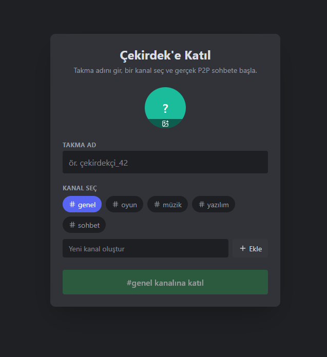

# Çekirdek P2P

Aşağıdaki yapı proje ana dizini için önerilen düzeni gösterir.

/ Cekirdek-P2P

- /app        - Expo Router (Sayfalar ve Navigasyon)
- /components - UI Bileşenleri (Atomic Design)
- /hooks      - Özel React Hook'ları (P2P mantığı)
- /services   - Altyapı köprüleri (Supabase, Simple-peer vb.)
- /server     - Python Twisted seeding motoru / sinyalleşme
- /assets     - Logolar, ikonlar ve örnek görseller
- .env        - Yerel ortam değişkenleri (gitignore yapılmalı)
- app.json    - Uygulama yapılandırması
- package.json- Bağımlılıklar

Görsel: Giriş ekranı (demo). Aşağıdaki görüntü repo içindeki Cekirdek-P2P/assets klasöründen yüklenir.

  

